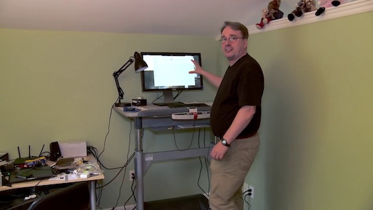
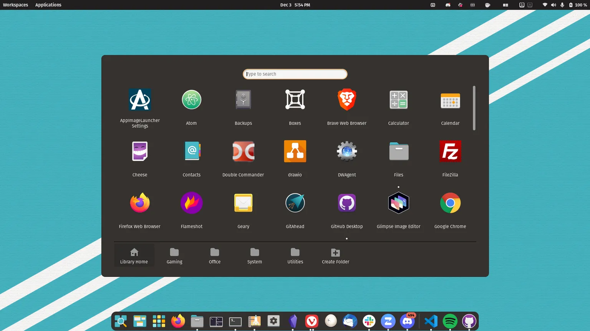
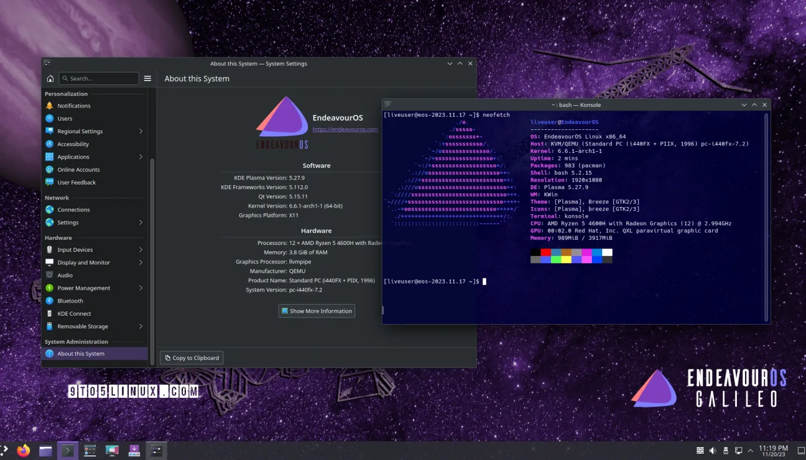
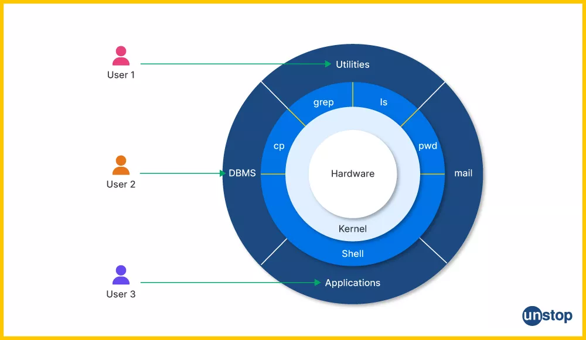
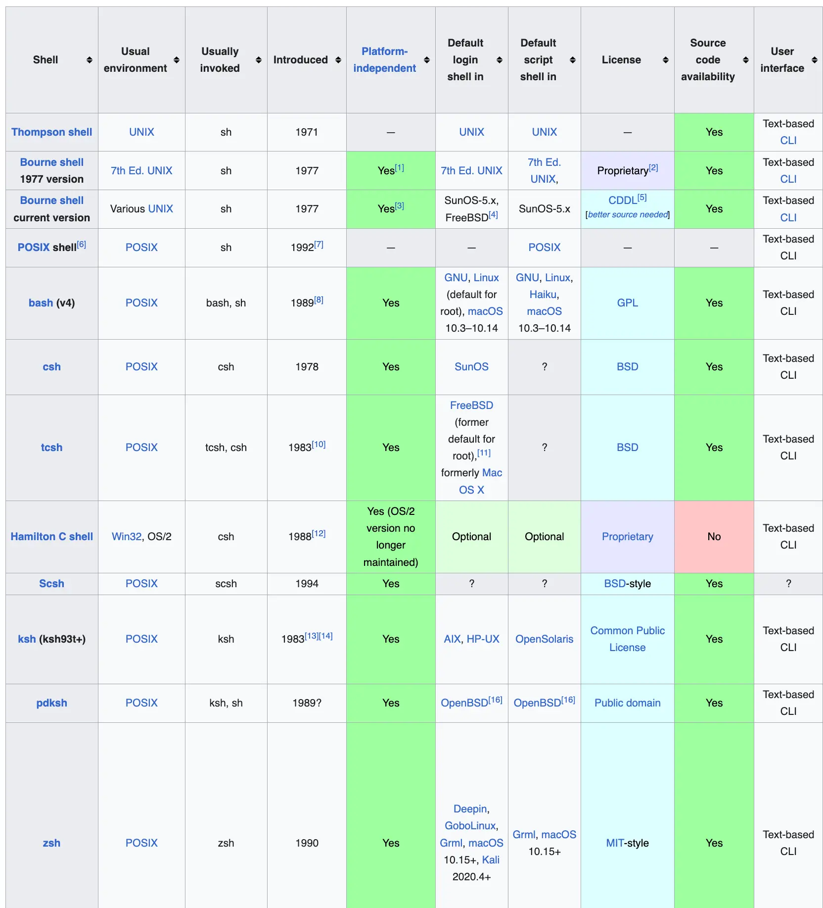
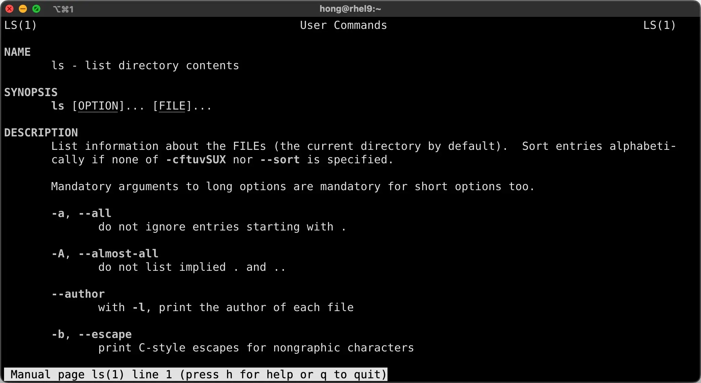

# Introduction to Linux


## What is Linux?

Linux is a **free and open-source operating system** that serves as a cornerstone in various computing environments, such as:

- **Servers:** Powering web servers, application servers, and database servers.
- **Supercomputers:** Used in computational research and simulations.
- **Mobile Devices:** Android OS is based on the Linux kernel.

### Key Features:
- **Stability:** Reliable performance, even under heavy workloads.
- **Security:** Built-in permissions and a strong community-driven development model.
- **Flexibility and Customization:** Highly modular and configurable.
- **Community Support:** Regular updates and patches contributed by developers worldwide.

### History:
- **Linux Kernel:** Developed by Linus Torvalds in 1991.
- **Open-source Movement:** Collaboratively maintained by a global community.

 

Credit: https://www.youtube.com/watch?v=jYUZAF3ePFE


---

## Open- vs. Closed-Source

### Open-Source:
- > Open-source software (OSS) is computer software that is released under a license in which the copyright holder grants users the rights to use, study, change, and distribute the software and its source code to anyone and for any purpose.
  >
  > Credit: https://en.wikipedia.org/wiki/Open-source_software
- **Examples:** Debian, Fedora.

### Closed-Source:
- While Linux is open-sourced, not all of its distributions are; as they may include closed-source components or add-ons.
- These closed-source components or add-ons can be additional software or drivers that are not publicly available. They are maintained by the Linux distribution provider or a third party. These are for profit companies that do not allow for the modification or redistribution of their code.
- **Examples:** 
  - Red Hat Enterprise Linux (RHEL), which combines open-source components with proprietary support services.
  - SteamOS, a public release of our Linux-based operating system. The base system draws from Debian 8, code named Debian Jessie.  https://store.steampowered.com/steamos


---

## Why Use Linux?

1. **Cost-Effectiveness:** Most distributions (distros) are free.
2. **Customizability:** Users can:
   - Modify system behavior.
   - Users can create their own distro if they wish. https://www.linuxfromscratch.org/
   - Even using an established distro, a user can still configure options in a wide variety of combinations.
3. **Flexibility:**
   - Install with or without a graphical interface.
   - Suitable for client machines or servers.
4. **Security:** Reduced vulnerabilities due to open-source transparency.
5. **Performance:** Minimal resource overhead.

**Real-Life Application:** NASA’s Mars Rovers use Linux. So technically, Linux is on Mars! https://www.theverge.com/2021/2/19/22291324/linux-perseverance-mars-curiosity-ingenuity


---

## Linux Distributions (Distros)

- **Definition:** a customized version of the Linux operating system. It combines the **Linux kernel** (the core of the OS) with a collection of software tools, utilities, and applications, along with a package management system. Each distro is designed for specific use cases, audiences, or preferences.
- Key Components of a Linux Distro:
  1. **Linux Kernel**: The core part that manages hardware, processes, and system resources.
  2. **GNU Tools**: Essential utilities for file management, text editing, and system configuration.
  3. **Package Manager**: Handles software installation, updates, and removal (e.g., `apt`, `yum`, `dnf`, `pacman`).
  4. **Default Software**: Varies between distros (e.g., desktop environments like GNOME or KDE).
  5. **Customization**: Some distros include unique configurations or optimizations for specific tasks.

 

Credit: https://www.reddit.com/r/DistroHopping/comments/1hubt22/the_stories_behind_debian_red_hat_and_arch_names/

### Popular Distros:
- **General-Purpose**:
  - **Ubuntu**: User-friendly, great for beginners.
  - **Fedora**: Focuses on cutting-edge technology.
  - **Debian**: Stable and reliable, ideal for servers.
- **Server-Oriented**:
  - **CentOS**: Popular in enterprise environments (now succeeded by AlmaLinux/Rocky Linux).
  - **Red Hat Enterprise Linux (RHEL)**: Enterprise-level features with paid support.
  - **Ubuntu Server**: Optimized for cloud and container environments.

- **Desktop-Focused:** Linux Mint , [Pop!_OS](https://pop.system76.com/), [EndeavourOS](https://endeavouros.com/).

  
  Credit: https://support.system76.com/articles/pop-basics/

  
  Credit: https://9to5linux.com/endeavouros-devs-say-goodbye-to-their-arm-branch-maintainers-needed

- **Specialized**:

  - **Kali Linux**: Built for penetration testing and cybersecurity.
  - **Arch Linux**: Highly customizable for advanced users.
  - **Raspberry Pi OS**: Tailored for Raspberry Pi hardware.
  - **openSUSE MicroOS**: Designed to host container workloads with automated administration & patching.

- **Lightweight**:

  - **Puppy Linux**: Designed for older or resource-constrained systems.
  - **Tiny Core Linux**: Minimal footprint, super lightweight.

### Why Are There So Many Distros?

The open-source nature of Linux allows anyone to modify and distribute their own version, leading to a wide variety of distros tailored to different needs.

**Fun Analogy**: Think of a Linux distro as a car:

- **Kernel**: The engine, driving the whole thing.
- **Tools & Utilities**: The steering wheel, pedals, and dashboard.
- **Customizations**: Paint job, seat covers, and radio. Each distro has its own vibe!

### Linux Subreddits

- https://www.reddit.com/r/linux/
- https://www.reddit.com/r/DistroHopping/
- https://www.reddit.com/r/rhel/
- https://www.reddit.com/r/Ubuntu/
- https://www.reddit.com/r/debian/
- https://www.reddit.com/r/archlinux/

### Red Hat Enterprise Linux (RHEL) Enterprise Features:

- **Stability:** Designed for critical environments.
- **Support:** Includes enterprise-grade support services.
- **Security:** Advanced tools like SELinux and patch management.
- **Scalability:** Handles high workloads efficiently.
- **Integration:** Optimized for cloud and container environments.


---

## The Shell

### What is a Shell?
- > https://unstop.com/blog/linux-shell
  >
  > *Linux shell refers to the interface/ interpreter program that takes human commands and parses them for the OS to execute. There are two primary types of shells, i.e., Command-line (CLI) and Graphical User Interface (GUI).*

   

  Credit: https://unstop.com/blog/linux-shell 
  
- **Examples:**
  
  - `sh` (Bourne Shell)
  - `bash` (Bourne Again Shell)
  - `zsh` (Z Shell)
  - `fish` (Friendly Interactive Shell)

### **Advantages Of Linux Shell**

> https://unstop.com/blog/linux-shell
>
> The Linux shell offers several advantages over the graphical user interface (GUIs):
>
> - **Efficiency:** Tasks can be completed more quickly, as the Linux shell requires fewer actions (clicks, menus) compared to a GUI.
> - **Flexibility:** Users have greater control over the system and can customize or automate tasks using shell scripts within the current shell environment.
> - **Remote Access:** The Linux shell can be accessed remotely, enabling users to manage Linux systems from anywhere with an internet connection.

### Key Functions of a Linux Shell:

- **Command Interpretation:**
  - Accepts commands from the user and interprets them.
  - Sends the commands to the Linux kernel for execution.
- **Process Management:**
  - Launches and manages processes (e.g., running programs or scripts).
  - Allows process control (e.g., suspending, resuming, terminating processes).
- **File and Directory Operations:**
  - Lets users navigate the file system using commands like `cd`, `ls`, `pwd`.
  - Handles file manipulations such as copying (`cp`), moving (`mv`), and removing (`rm`).
- **Environment Management:**
  - Defines environment variables (e.g., `PATH`, `HOME`) that influence program behavior.
  - Allows customization through configuration files like `~/.bashrc` or `/etc/profile`.
- **Input and Output Redirection:**
  - Redirects input/output using symbols:
    - `>`: Redirects output to a file.
    - `<`: Redirects input from a file.
    - `|`: Pipes output from one command to another.
- **Scripting:**
  - Executes sequences of commands stored in script files (e.g., `.sh` files).
  - Supports loops, conditionals, and variables for automation.

### How it Works:

1. The shell takes user commands and interprets them.
2. It interacts with the kernel to execute them.
3. It displays the results.

You can write your own shell. https://brennan.io/2015/01/16/write-a-shell-in-c/

### [Comparison of command shells](https://en.wikipedia.org/wiki/Comparison_of_command_shells)

 

### Change Default Shell:

- You can switch from one shell to another by typing the shell’s name (such as `tcsch`, `bash`, or `zsh`) on your command line.
- You can have multiple shells open simultaneously.
- Changing default shell from bash to zsh `chsh -s $(which zsh)`. More on https://www.cyberciti.biz/faq/change-my-default-shell-in-linux-using-chsh/

### Bash Shell:

- **Configuration Files:**
  - `/etc/profile`: sets up the environment configuration for all users.
  - `~/.profile`: User-specific settings (overrides global).
  - `.bashrc` contains commands that are specific to the Bash shells.
  - The users file will always override the global configuration file
  - Read more on https://www.baeldung.com/linux/bashrc-vs-bash-profile-vs-profile
- **Prompt Symbols:**
  - `$`: Regular user.
  - `#`: Superuser (root).


---

## Basic Bash Commands

### Super Users

- Standard users cannot make use of some commands, typically the more advanced ones – the ones most likely to damage the system if used incorrectly.
- Best practice is to **NOT** log into the system as the root user unless necessary. For situations where we need to use root commands, we have the `sudo` command.

 

Credit: https://xkcd.com/149/

### Superuser Do

- `sudo` stands for "superuser do" and is the master key to your high-privilege admin tasks. 
- Simply preface the intended command with `sudo`. You will then be prompted for a password (you need to enter your user account password, not root’s).
- Run `sudo` without a password: https://developers.redhat.com/blog/2018/08/15/how-to-enable-sudo-on-rhel.
- The `sudo` privilege is given on a per-user or per-group basis. To ensure that your account has this privilege, you must be added to the sudoers file (`/etc/sudoers`).
  - Red Hat uses the `wheel` group to give users elevated privileges by default.
  - Ubuntu uses the `sudo` group to give users elevated privileges by default.
- [Granting sudo access to a user](https://docs.redhat.com/en/documentation/red_hat_enterprise_linux/8/html/configuring_basic_system_settings/managing-sudo-access_configuring-basic-system-settings#granting-sudo-access-to-a-user_managing-sudo-access)

### Getting Help with Commands

- To get help with any command you are looking into, you can add the the `--help` option following the command.
- This brings up information regarding what mandatory and optional information goes along with the command.
- Man pages are the go-to resource for nearly every Linux user working at the command line. Using the man pages is straightforward; simply type the `man` command and include the command you need more information about. For example, to display the manual for the `ls` command, type `man ls`.

``` 
[hong@rhel9 ~]$ passwd --help
Usage: passwd [OPTION...] <accountName>
  -k, --keep-tokens       keep non-expired authentication tokens
  -d, --delete            delete the password for the named account (root only); also removes password lock if any
  -l, --lock              lock the password for the named account (root only)
  -u, --unlock            unlock the password for the named account (root only)
  -e, --expire            expire the password for the named account (root only)
  -f, --force             force operation
  -x, --maximum=DAYS      maximum password lifetime (root only)
  -n, --minimum=DAYS      minimum password lifetime (root only)
  -w, --warning=DAYS      number of days warning users receives before password expiration (root only)
  -i, --inactive=DAYS     number of days after password expiration when an account becomes disabled (root only)
  -S, --status            report password status on the named account (root only)
      --stdin             read new tokens from stdin (root only)

Help options:
  -?, --help              Show this help message
      --usage             Display brief usage message
```

 

### whoami

- The whoami command is used to check what user is logged in.
- Not all Linux distros show the username as part of the prompt, which makes this command important to know.
- `id -un` prints the user name as well.

```
$ id --help
Usage: id [OPTION]... [USER]...
Print user and group information for each specified USER,
or (when USER omitted) for the current user.

  -a             ignore, for compatibility with other versions
  -Z, --context  print only the security context of the process
  -g, --group    print only the effective group ID
  -G, --groups   print all group IDs
  -n, --name     print a name instead of a number, for -ugG
  -r, --real     print the real ID instead of the effective ID, with -ugG
  -u, --user     print only the effective user ID
  -z, --zero     delimit entries with NUL characters, not whitespace;
                   not permitted in default format
      --help     display this help and exit
      --version  output version information and exit

Without any OPTION, print some useful set of identified information.

GNU coreutils online help: <https://www.gnu.org/software/coreutils/>
Full documentation <https://www.gnu.org/software/coreutils/id>
or available locally via: info '(coreutils) id invocation'
```

### What day is it?

- The date command can be used on its own, or it may include arguments to fine-tune the output.
- The default output is a full timestamp, with the date and time.
- By adding arguments to the command, we can obtain just the current date.

```
[hong@rhel9 ~]$ date
Sun 05 Jan 2025 08:10:21 PM MST

[hong@rhel9 ~]$ date +%Y/%m/%d
2025/01/05
```

### Passwords

- The `passwd` command changes passwords for user accounts.
- A normal user may only change the password for their own account, while the superuser may change the password for any account.
- `passwd` also changes the account or associated password validity period. 

[Managing Linux users with the passwd command](https://www.redhat.com/en/blog/managing-users-passwd)

```
[hong@rhel9 ~]$ passwd
Changing password for user hong.
Current password:
New password:
Retype new password:
passwd: all authentication tokens updated successfully.

# Notice that a superuser 'breakglass' change the password for user 'hong'
[breakglass@rhel9 ~]$ sudo passwd hong
Changing password for user hong.
New password:
Retype new password:
passwd: all authentication tokens updated successfully.
```

### History

- The output of the history command details past commands that have been used at the command line.
- You can limit the output by specifying how many commands you would like to see, beginning with the most recent.

```
[hong@rhel9 ~]$ history 10
   70  sudo su breakglass
   71  history
   72  history 10
   73  htop
   74  top
   75  strace ls
   76  history
   77  pwd
   78  ls /usr/local/bin
   79  history 10
```

### File

- The file command returns output regarding the type of file being presented, and data regarding that file.

```
[hong@rhel9 ~]$ file /usr/local/bin/node
/usr/local/bin/node: ELF 64-bit LSB executable, x86-64, version 1 (GNU/Linux), dynamically linked, interpreter /lib64/ld-linux-x86-64.so.2, BuildID[sha1]=314a8e24a99731ed1b375660a93f7253ed293435, for GNU/Linux 3.2.0, with debug_info, not stripped, too many notes (256)

[hong@rhel9 ~]$ file rhcsa9.png
rhcsa9.png: PNG image data, 1912 x 986, 8-bit/color RGBA, non-interlaced

[hong@rhel9 ~]$ file rhcsa9.jpg
rhcsa9.jpg: JPEG image data, JFIF standard 1.02, resolution (DPI), density 72x72, segment length 16, Exif Standard: [TIFF image data, big-endian, direntries=6, orientation=upper-left, xresolution=86, yresolution=94, resolutionunit=2], baseline, precision 8, 1912x986, components 3
```

### Concatenate - cat

- The `cat` command is important as a basic command because it serves two very important functions:
  - concatenating (merging) files (as the name suggests) 
  - and printing the contents of a file to the screen. Printing the contents of files is by far the more frequent use of this command.

```
[hong@rhel9 ~]$ cat /etc/passwd
root:x:0:0:root:/root:/bin/bash
bin:x:1:1:bin:/bin:/sbin/nologin
daemon:x:2:2:daemon:/sbin:/sbin/nologin
adm:x:3:4:adm:/var/adm:/sbin/nologin
lp:x:4:7:lp:/var/spool/lpd:/sbin/nologin
sync:x:5:0:sync:/sbin:/bin/sync
shutdown:x:6:0:shutdown:/sbin:/sbin/shutdown
halt:x:7:0:halt:/sbin:/sbin/halt
mail:x:8:12:mail:/var/spool/mail:/sbin/nologin
operator:x:11:0:operator:/root:/sbin/nologin
games:x:12:100:games:/usr/games:/sbin/nologin
ftp:x:14:50:FTP User:/var/ftp:/sbin/nologin
nobody:x:65534:65534:Kernel Overflow User:/:/sbin/nologin
unbound:x:999:999:Unbound DNS resolver:/etc/unbound:/sbin/nologin
tss:x:59:59:Account used for TPM access:/:/usr/sbin/nologin
systemd-coredump:x:998:996:systemd Core Dumper:/:/sbin/nologin
dbus:x:81:81:System message bus:/:/sbin/nologin
polkitd:x:997:994:User for polkitd:/:/sbin/nologin
sssd:x:996:993:User for sssd:/:/sbin/nologin
chrony:x:995:992:chrony system user:/var/lib/chrony:/sbin/nologin
sshd:x:74:74:Privilege-separated SSH:/usr/share/empty.sshd:/usr/sbin/nologin
hong:x:1000:1000:Hong Yan:/home/hong:/usr/bin/zsh
breakglass:x:1001:1001::/home/breakglass:/bin/bash
```

`bat` is a modern version of `cat` with syntax highlighting, Git integration, and more: https://www.redhat.com/en/blog/linux-bat-command

### `tail` and `head`

- The `tail` and `head` commands print the output of the last and first ten lines of a file, respectively.
- You can configure the number of lines displayed for both the commands with option `-n`.

```
# head without command line arguments displays first 10 lines of /etc/passwd file
[hong@rhel9 ~]$ head /etc/passwd
root:x:0:0:root:/root:/bin/bash
bin:x:1:1:bin:/bin:/sbin/nologin
daemon:x:2:2:daemon:/sbin:/sbin/nologin
adm:x:3:4:adm:/var/adm:/sbin/nologin
lp:x:4:7:lp:/var/spool/lpd:/sbin/nologin
sync:x:5:0:sync:/sbin:/bin/sync
shutdown:x:6:0:shutdown:/sbin:/sbin/shutdown
halt:x:7:0:halt:/sbin:/sbin/halt
mail:x:8:12:mail:/var/spool/mail:/sbin/nologin
operator:x:11:0:operator:/root:/sbin/nologin

# Display first 3 lines of /etc/passwd file
[hong@rhel9 ~]$ head -3 /etc/passwd
root:x:0:0:root:/root:/bin/bash
bin:x:1:1:bin:/bin:/sbin/nologin
daemon:x:2:2:daemon:/sbin:/sbin/nologin

# Display last 10 lines of /var/log/secure file
[hong@rhel9 ~]$ sudo tail /var/log/secure
Jan  5 20:19:10 rhel9 sshd[35176]: pam_unix(sshd:session): session opened for user hong(uid=1000) by hong(uid=0)
Jan  5 20:19:10 rhel9 sshd[35179]: Received disconnect from 10.0.0.1 port 53200:11: disconnected by user
Jan  5 20:19:10 rhel9 sshd[35179]: Disconnected from user hong 10.0.0.1 port 53200
Jan  5 20:19:10 rhel9 sshd[35176]: pam_unix(sshd:session): session closed for user hong
Jan  5 20:33:45 rhel9 sudo[35221]:    hong : TTY=pts/0 ; PWD=/var/log ; USER=root ; COMMAND=/bin/cat secure
Jan  5 20:33:45 rhel9 sudo[35221]: pam_unix(sudo:session): session opened for user root(uid=0) by hong(uid=1000)
Jan  5 20:33:45 rhel9 sudo[35221]: pam_unix(sudo:session): session closed for user root
Jan  5 20:33:50 rhel9 sudo[35224]:    hong : TTY=pts/0 ; PWD=/var/log ; USER=root ; COMMAND=/bin/tail secure
Jan  5 20:33:50 rhel9 sudo[35224]: pam_unix(sudo:session): session opened for user root(uid=0) by hong(uid=1000)
Jan  5 20:33:50 rhel9 sudo[35224]: pam_unix(sudo:session): session closed for user root
```

### `more` and `less`

- The more command is used to display larger files, one screen at a time. You can advance one line at a time by pressing the `Enter` key, or one screen at a time by pressing the `space` bar. (Use `q` to quit)
- The less command gives much the same output as the more command does but adds the ability to scroll forwards (`d` for down) and back (`u` for up) through the text. (Use `q` to quit)
- [When `less` is better than `more`](https://www.redhat.com/en/blog/when-more-less-because-one-tool-never-enough)
  - allows forward and reverse scrolling,
  - allows forward and reverse searching,
  - immediately skips to the end or beginning of the file or output,
  - allows faster access by not loading the entire file into memory at one time.

### Word Count

- The default output of `wc` is the file's number of lines, words, and characters, followed by its path.
- `wc -l` print the newline counts.

```
$ wc zombie-apocalypse_plan-A.txt
188  581 3591 zombie-apocalypse_plan-A.txt
```

[3 surprising things you can do with the Linux wc command](https://www.redhat.com/en/blog/linux-wc-command)

### Repeating commands

- To repeat a command, you can use double exclamation marks `!!`. In UNIX/Linux world, we call `!` a **bang**.
- Repeating the nth command from your bash history (counting up from the bottom) is as simple as using a bang with a minus and the number in question.

```
$ cat hello.txt 
Hello world ..!
$ !!
cat hello.txt 
Hello world ..!

[hong@rhel9 ~]$ !-3
sudo ls /var/log/secure
/var/log/secure
```

[Bash bang commands: A must-know trick for the Linux command line](https://www.redhat.com/en/blog/bash-bang-commands)


---

## Linux File System

### Hierarchical Structure:

 

Credit: the image is kindly supplied under a CC By-SA license by Paul Gardner.

[Conventional directory layout](https://en.wikipedia.org/wiki/Unix_filesystem#Conventional_directory_layout)

Here is a generalized overview of common locations of files on a Unix operating system:

| Directory or file | Description                                                  |
| :---------------: | :----------------------------------------------------------- |
|        `/`        | The slash `/` character alone denotes the root of the filesystem tree. |
|      `/bin`       | Stands for *[binaries](https://en.wikipedia.org/wiki/Computer_program)* and contains certain fundamental utilities, such as `ls` or `cp`, that are needed to mount `/usr`, when that is a separate filesystem, or to run in one-user (administrative) mode when `/usr` cannot be mounted. In System V.4, this is a symlink to `/usr/bin`. Otherwise, it needs to be on the root filesystem itself. |
|      `/boot`      | Contains all the files needed for successful booting process. In [Research Unix](https://en.wikipedia.org/wiki/Research_Unix), this was one file rather than a directory.[[14\]](https://en.wikipedia.org/wiki/Unix_filesystem#cite_note-upe-14) Nowadays usually on the root filesystem itself, unless the system, bootloader etc. require otherwise. |
|      `/dev`       | Stands for *devices*. Contains [file representations](https://en.wikipedia.org/wiki/Device_node) of peripheral devices and [pseudo-devices](https://en.wikipedia.org/wiki/Device_file#Pseudo-devices). See also: [Linux Assigned Names and Numbers Authority](https://en.wikipedia.org/wiki/Linux_Assigned_Names_and_Numbers_Authority). Needs to be on the root filesystem itself. |
|      `/etc`       | Contains system-wide configuration files and system databases; the name stands for *[et cetera](https://en.wikipedia.org/wiki/Et_cetera)*[[14\]](https://en.wikipedia.org/wiki/Unix_filesystem#cite_note-upe-14) but now a better expansion is **e**ditable-**t**ext-**c**onfigurations. Originally also contained "dangerous maintenance utilities" such as `init`,[[6\]](https://en.wikipedia.org/wiki/Unix_filesystem#cite_note-v7-6) but these have typically been moved to `/sbin` or elsewhere. Needs to be on the root filesystem itself. |
|      `/home`      | Contains user home directories on Linux and some other systems. In the original version of Unix, home directories were in `/usr` instead.[[15\]](https://en.wikipedia.org/wiki/Unix_filesystem#cite_note-notes72-15) Some systems use or have used different locations still: [macOS](https://en.wikipedia.org/wiki/MacOS) has home directories in `/Users`, older versions of BSD put them in `/u`, [FreeBSD](https://en.wikipedia.org/wiki/FreeBSD) has `/usr/home`. |
|      `/lib`       | Originally *essential libraries*: [C](https://en.wikipedia.org/wiki/C_(programming_language)) libraries, but not [Fortran](https://en.wikipedia.org/wiki/Fortran) ones.[[14\]](https://en.wikipedia.org/wiki/Unix_filesystem#cite_note-upe-14) On modern systems, it contains the shared libraries needed by programs in `/bin`, and possibly [loadable kernel module](https://en.wikipedia.org/wiki/Loadable_kernel_module), [device drivers](https://en.wikipedia.org/wiki/Device_driver) or [binary blobs](https://en.wikipedia.org/wiki/Binary_blob). Linux distributions may have variants `/lib32` and `/lib64` for multi-architecture support. |
|     `/media`      | Default mount point for removable devices, such as USB sticks, media players, etc. By common sense, the directory itself, whose subdirectories are mountpoints, is on the root partition itself. |
|      `/mnt`       | Stands for *mount*. Empty directory commonly used by system administrators as a temporary mount point. By common sense, the directory itself, whose subdirectories are mountpoints, is on the root partition itself. |
|      `/opt`       | Contains locally installed software. Originated in [System V](https://en.wikipedia.org/wiki/UNIX_System_V), which has a [package manager](https://en.wikipedia.org/wiki/Package_manager) that installs software to this directory (one subdirectory per package).[[16\]](https://en.wikipedia.org/wiki/Unix_filesystem#cite_note-16) |
|      `/proc`      | [procfs](https://en.wikipedia.org/wiki/Procfs) virtual [filesystem](https://en.wikipedia.org/wiki/File_system) showing information about [processes](https://en.wikipedia.org/wiki/Process_(computing)) as files. |
|      `/root`      | The home directory for the [superuser](https://en.wikipedia.org/wiki/Superuser) *root* - that is, the system administrator. This account's home directory is usually on the initial filesystem, and hence not in /home (which may be a mount point for another filesystem) in case specific maintenance needs to be performed, during which other filesystems are not available. Such a case could occur, for example, if a hard disk drive suffers failures and cannot be properly mounted. |
|      `/sbin`      | Stands for "[system (or superuser) binaries](https://en.wikipedia.org/wiki/Computer_program)" and contains fundamental utilities, such as `init`, usually needed to start, maintain and recover the system. Needs to be on the root partition itself. |
|      `/srv`       | Server data (data for services provided by system).          |
|      `/sys`       | In some [Linux distributions](https://en.wikipedia.org/wiki/Linux_distribution), contains a [sysfs](https://en.wikipedia.org/wiki/Sysfs) virtual [filesystem](https://en.wikipedia.org/wiki/File_system), containing information related to hardware and the operating system. On BSD systems, commonly a symlink to the kernel sources in `/usr/src/sys`. |
|      `/tmp`       | A place for temporary files not expected to survive a reboot. Many systems clear this directory upon startup or use [tmpfs](https://en.wikipedia.org/wiki/Tmpfs) to implement it. |
|      `/unix`      | The Unix [kernel](https://en.wikipedia.org/wiki/Kernel_(operating_system)) in Research Unix and [System V](https://en.wikipedia.org/wiki/UNIX_System_V).[[14\]](https://en.wikipedia.org/wiki/Unix_filesystem#cite_note-upe-14) With the addition of [virtual memory](https://en.wikipedia.org/wiki/Virtual_memory) support to [3BSD](https://en.wikipedia.org/wiki/Berkeley_Software_Distribution#3BSD), this got renamed `/vmunix`. |
|      `/usr`       | The "user file system": originally the directory holding user home directories,[[15\]](https://en.wikipedia.org/wiki/Unix_filesystem#cite_note-notes72-15) but already by the Third Edition of [Research Unix](https://en.wikipedia.org/wiki/Research_Unix), ca. 1973, reused to split the operating system's programs over two disks (one of them a 256K fixed-head drive) so that basic commands would either appear in `/bin` or `/usr/bin`.[[17\]](https://en.wikipedia.org/wiki/Unix_filesystem#cite_note-reader-17) It now holds executables, libraries, and shared resources that are not system critical, such as the [X Window System](https://en.wikipedia.org/wiki/X_Window_System), [window managers](https://en.wikipedia.org/wiki/Window_manager), [scripting languages](https://en.wikipedia.org/wiki/Scripting_language), etc. In older Unix systems, user home directories might still appear in `/usr` alongside directories containing programs, although by 1984 this depended on local customs.[[14\]](https://en.wikipedia.org/wiki/Unix_filesystem#cite_note-upe-14) |
|  `/usr/include`   | Stores the development headers used throughout the system. [Header files](https://en.wikipedia.org/wiki/Header_file) are mostly used by the `#include` directive in [C](https://en.wikipedia.org/wiki/C_(programming_language)) language, which historically is how the name of this directory was chosen. |
|    `/usr/lib`     | Stores the needed libraries and data files for programs stored within `/usr` or elsewhere. |
|  `/usr/libexec`   | Holds programs meant to be executed by other programs rather than by users directly. E.g., the [Sendmail](https://en.wikipedia.org/wiki/Sendmail) executable may be found in this directory.[[18\]](https://en.wikipedia.org/wiki/Unix_filesystem#cite_note-18) Not present in the FHS until 2011;[[19\]](https://en.wikipedia.org/wiki/Unix_filesystem#cite_note-19) Linux distributions have traditionally moved the contents of this directory into `/usr/lib`, where they also resided in 4.3BSD. |
|   `/usr/local`    | Resembles `/usr` in structure, but its subdirectories are used for additions not part of the operating system distribution, such as custom programs or files from a [BSD](https://en.wikipedia.org/wiki/BSD) [Ports collection](https://en.wikipedia.org/wiki/Ports_collection). Usually has subdirectories such as `/usr/local/lib` or `/usr/local/bin`. |
|   `/usr/share`    | Architecture-independent program data. On Linux and modern BSD derivatives, this directory has subdirectories such as `man` for [manpages](https://en.wikipedia.org/wiki/Manpage), that used to appear directly under `/usr` in older versions. |
|      `/var`       | Stands for *variable*. A place for files that might change frequently - especially in size, for example e-mail sent to users on the system, or process-ID [lock files](https://en.wikipedia.org/wiki/Lock_file). |
|    `/var/log`     | Contains system log files.                                   |
|    `/var/mail`    | The place where all incoming mail is stored. Users (other than `root`) can access their own mail only. Often, this directory is a [symbolic link](https://en.wikipedia.org/wiki/Symbolic_link) to `/var/spool/mail`. |
|   `/var/spool`    | [Spool](https://en.wikipedia.org/wiki/Spooling) directory. Contains print jobs, mail spools and other queued tasks. |
|    `/var/src`     | The place where the uncompiled source code of some programs is. |
|    `/var/tmp`     | The `/var/tmp` directory is a place for temporary files which should be preserved between system reboots. |

- **Key Directories:**
  - `/`: Base of all files and directories.
  - `/bin`: Essential binaries (e.g., `ls`, `cp`).
  - `/boot`: The `/boot` directory contains files required for starting your system. **DO NOT TOUCH!**
  - `/dev`: `/dev` contains device files. Many of these are generated at boot time or even on the fly.
  - `/sbin`: System binaries (e.g., `fsck`, `iptables`).
  - `/etc`: *etc* stands for “Everything to configure,” as it contains most, if not all system-wide configuration files.
  - `/home`: User home directories.
  - `/var`: Variable data like logs.
  - `/tmp`: Temporary files.

### Path

https://www.linuxfoundation.org/blog/blog/classic-sysadmin-absolute-path-vs-relative-path-in-linux-unix

> A path is a unique location to a file or a folder in a file system of an OS. A path to a file is a combination of / and alpha-numeric characters.

- Absolute path: An absolute path is defined as the specifying the location of a file or directory from the root directory(`/`). In other words we can say absolute path is a complete path from start of actual filesystem from `/` directory.
- You can always get the absolute path of a file with the `realpath` command.
- Relative path: Relative path is defined as path related to the present working directory(`pwd`).

```
# Absolute path
$ cd /usr/local/bin

[hong@rhel9 log]$ realpath lastlog
/var/log/lastlog

# Relative path
[hong@rhel9 tmp]$ cd labs
[hong@rhel9 labs]$ tree .
.
├── lab1
├── lab2  <- after `cd lab2` command, you are here.
└── lab3  <- use `cd ../lab3` to go here. `..` is parent folder.

[hong@rhel9 labs]$ cd lab2
[hong@rhel9 lab2]$ pwd
/tmp/labs/lab2

# More on `cd` command later
[hong@rhel9 lab2]$ cd ../lab3
[hong@rhel9 lab3]$ pwd
/tmp/labs/lab3
```

### List

- The `ls` command is used to display the contents of the current folder. This only displays the names of files or folders in the directory.
- The `-l` option signifies the long list format. This shows a lot more information presented to the user than the standard command. You will see the file permissions, the number of links, owner name, owner group, file size, time of last modification, and the file or directory name. This option is used in conjunction with many other options on a regular basis.
- The `-lh` flag is the same long list format command as above, however, the file size is displayed in a human-readable format. Notice the difference between the file size outputs in the previous two screens.

```
# Note that `/usr` absolute path is used
[hong@rhel9 usr]$ ls /usr
bin  games  include  lib  lib64  libexec  local  sbin  share  src  tmp

[hong@rhel9 usr]$ ls -l
total 132
dr-xr-xr-x.   2 root root 28672 Jan  5 21:01 bin
drwxr-xr-x.   2 root root     6 Jun 25  2024 games
drwxr-xr-x.  33 root root  4096 Jan  3 22:26 include
dr-xr-xr-x.  34 root root  4096 Jan  3 22:26 lib
dr-xr-xr-x.  53 root root 32768 Jan  3 22:28 lib64
drwxr-xr-x.  31 root root  4096 Jan  3 22:26 libexec
drwxr-xr-x.  13 root root   140 Jan  3 22:27 local
dr-xr-xr-x.   2 root root 12288 Jan  3 22:21 sbin
drwxr-xr-x. 101 root root  4096 Jan  4 17:38 share
drwxr-xr-x.   4 root root    34 Jan  3 21:18 src

[hong@rhel9 usr]$ ls -lh
total 132K
dr-xr-xr-x.   2 root root  28K Jan  5 21:01 bin
drwxr-xr-x.   2 root root    6 Jun 25  2024 games
drwxr-xr-x.  33 root root 4.0K Jan  3 22:26 include
dr-xr-xr-x.  34 root root 4.0K Jan  3 22:26 lib
dr-xr-xr-x.  53 root root  32K Jan  3 22:28 lib64
drwxr-xr-x.  31 root root 4.0K Jan  3 22:26 libexec
drwxr-xr-x.  13 root root  140 Jan  3 22:27 local
dr-xr-xr-x.   2 root root  12K Jan  3 22:21 sbin
drwxr-xr-x. 101 root root 4.0K Jan  4 17:38 share
drwxr-xr-x.   4 root root   34 Jan  3 21:18 src
```

More about `ls` command: [11 ways to use the `ls` command in Linux](https://www.redhat.com/en/blog/ls-command-options)

### Print Working Directory

- The `pwd` command prints the current/working directory, telling where you are currently located in the filesystem.
- This command comes to your rescue when you get lost in the filesystem, and always prints out the *absolute path*.

```
[hong@rhel9 usr]$ cd local
[hong@rhel9 local]$ cd bin
[hong@rhel9 bin]$ pwd
/usr/local/bin
```

### Change Directory

- The `cd` command lets you change to a different directory. When you log into a Linux machine or fire up a terminal emulator, by default your working directory is your home directory.
- Absolute and relative paths make more sense when we look at examples for the `cd` command. If you need to move one level up from your working directory, in this case `/home`, we can do this couple of ways. One way is to issue a `cd ..` command relative to your `pwd`. Remember, `..` represents the directory one level above the working directory.
- The other way is to provide the absolute path to the directory: `cd /home`
- The `cd` command can be used with a relative path to move you from a sub-directory in a branch to another sub-directory in the same branch.
- If your working directory is deeply nested inside the filesystem and you need to return to your home directory, this is where the `~` comes in with the `cd` command.
- Previous Directory: The `cd -` command can be used to return the user to the last directory they were working in by using the hyphen or dash key.

```
# Go back to your home
[hong@rhel9 bin]$ cd ~
[hong@rhel9 ~]$ pwd
/home/hong

# Go up a level by using double dots `..`
[hong@rhel9 ~]$ cd ..
[hong@rhel9 home]$ pwd
/home

# `cd` without options takes you back to your home too
[hong@rhel9 home]$ cd
[hong@rhel9 ~]$ pwd
/home/hong

# Use absolute path
[hong@rhel9 ~]$ cd /home

# The cd command can be used to return the user to the
# root directory of the file system by using the forward-slash.
[hong@rhel9 home]$ cd /
[hong@rhel9 /]$ pwd
/

# `cd -` returns the user to the last directory they were working in
[hong@rhel9 /]$ cd ~
[hong@rhel9 ~]$ pwd
/home/hong
[hong@rhel9 ~]$ cd /usr/local/bin
[hong@rhel9 bin]$ pwd
/usr/local/bin
[hong@rhel9 bin]$ cd -
/home/hong
[hong@rhel9 ~]$ pwd
/home/hong
```


---

## Network Management

### Viewing Interfaces:
- `ip link`: Lists all network interfaces.
- `ip addr`: Displays detailed IP configuration.

### Managing Interfaces:
- `nmcli`: Network Manager Command Line Interface.
- `nmtui`: Text-based user interface for network configuration.

---

## Summary

- Linux is a robust, flexible, and secure operating system.
- Offers extensive customization and cost-effectiveness.
- Key components include distributions, shells, file systems, and networking tools.

**For further study:** Refer to Red Hat Academy's RH124 materials, Chapters 1-3 and 12.