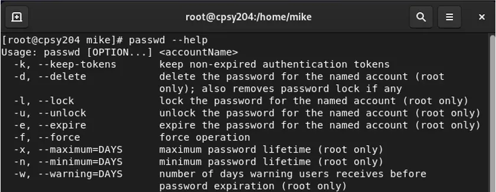

# Introduction to Linux


## What is Linux?

Linux is a **free and open-source operating system** that serves as a cornerstone in various computing environments, such as:

- **Servers:** Powering web servers, application servers, and database servers.
- **Supercomputers:** Used in computational research and simulations.
- **Mobile Devices:** Android OS is based on the Linux kernel.

### Key Features:
- **Stability:** Reliable performance, even under heavy workloads.
- **Security:** Built-in permissions and a strong community-driven development model.
- **Flexibility and Customization:** Highly modular and configurable.
- **Community Support:** Regular updates and patches contributed by developers worldwide.

### History:
- **Linux Kernel:** Developed by Linus Torvalds in 1991.
- **Open-source Movement:** Collaboratively maintained by a global community.


Credit: https://www.youtube.com/watch?v=jYUZAF3ePFE


---

## Open- vs. Closed-Source

### Open-Source:
- > Open-source software (OSS) is computer software that is released under a license in which the copyright holder grants users the rights to use, study, change, and distribute the software and its source code to anyone and for any purpose.
  >
  > Credit: https://en.wikipedia.org/wiki/Open-source_software
- **Examples:** Debian, Fedora.

### Closed-Source:
- While Linux is open-sourced, not all of its distributions are; as they may include closed-source components or add-ons.
- These closed-source components or add-ons can be additional software or drivers that are not publicly available. They are maintained by the Linux distribution provider or a third party. These are for profit companies that do not allow for the modification or redistribution of their code.
- **Examples:** 
  - Red Hat Enterprise Linux (RHEL), which combines open-source components with proprietary support services.
  - SteamOS, a public release of our Linux-based operating system. The base system draws from Debian 8, code named Debian Jessie.  https://store.steampowered.com/steamos


---

## Why Use Linux?

1. **Cost-Effectiveness:** Most distributions (distros) are free.
2. **Customizability:** Users can:
   - Modify system behavior.
   - Users can create their own distro if they wish. https://www.linuxfromscratch.org/
   - Even using an established distro, a user can still configure options in a wide variety of combinations.
3. **Flexibility:**
   - Install with or without a graphical interface.
   - Suitable for client machines or servers.
4. **Security:** Reduced vulnerabilities due to open-source transparency.
5. **Performance:** Minimal resource overhead.

**Real-Life Application:** NASA’s Mars Rovers use Linux. So technically, Linux is on Mars! https://www.theverge.com/2021/2/19/22291324/linux-perseverance-mars-curiosity-ingenuity


---

## Linux Distributions (Distros)

- **Definition:** a customized version of the Linux operating system. It combines the **Linux kernel** (the core of the OS) with a collection of software tools, utilities, and applications, along with a package management system. Each distro is designed for specific use cases, audiences, or preferences.
- Key Components of a Linux Distro:
  1. **Linux Kernel**: The core part that manages hardware, processes, and system resources.
  2. **GNU Tools**: Essential utilities for file management, text editing, and system configuration.
  3. **Package Manager**: Handles software installation, updates, and removal (e.g., `apt`, `yum`, `dnf`, `pacman`).
  4. **Default Software**: Varies between distros (e.g., desktop environments like GNOME or KDE).
  5. **Customization**: Some distros include unique configurations or optimizations for specific tasks.


Credit: https://www.reddit.com/r/DistroHopping/comments/1hubt22/the_stories_behind_debian_red_hat_and_arch_names/

### Popular Distros:
- **General-Purpose**:
  - **Ubuntu**: User-friendly, great for beginners.
  - **Fedora**: Focuses on cutting-edge technology.
  - **Debian**: Stable and reliable, ideal for servers.
- **Server-Oriented**:
  - **CentOS**: Popular in enterprise environments (now succeeded by AlmaLinux/Rocky Linux).
  - **Red Hat Enterprise Linux (RHEL)**: Enterprise-level features with paid support.
  - **Ubuntu Server**: Optimized for cloud and container environments.

- **Desktop-Focused:** Linux Mint , [Pop!_OS](https://pop.system76.com/), [EndeavourOS](https://endeavouros.com/).

  
  Credit: https://support.system76.com/articles/pop-basics/

  
  Credit: https://9to5linux.com/endeavouros-devs-say-goodbye-to-their-arm-branch-maintainers-needed

- **Specialized**:

  - **Kali Linux**: Built for penetration testing and cybersecurity.
  - **Arch Linux**: Highly customizable for advanced users.
  - **Raspberry Pi OS**: Tailored for Raspberry Pi hardware.
  - **openSUSE MicroOS**: Designed to host container workloads with automated administration & patching.

- **Lightweight**:

  - **Puppy Linux**: Designed for older or resource-constrained systems.
  - **Tiny Core Linux**: Minimal footprint, super lightweight.

### Why Are There So Many Distros?

The open-source nature of Linux allows anyone to modify and distribute their own version, leading to a wide variety of distros tailored to different needs.

**Fun Analogy**: Think of a Linux distro as a car:

- **Kernel**: The engine, driving the whole thing.
- **Tools & Utilities**: The steering wheel, pedals, and dashboard.
- **Customizations**: Paint job, seat covers, and radio. Each distro has its own vibe!

### Linux Subreddits

- https://www.reddit.com/r/linux/
- https://www.reddit.com/r/DistroHopping/
- https://www.reddit.com/r/rhel/
- https://www.reddit.com/r/Ubuntu/
- https://www.reddit.com/r/debian/
- https://www.reddit.com/r/archlinux/

### Red Hat Enterprise Linux (RHEL) Enterprise Features:

- **Stability:** Designed for critical environments.
- **Support:** Includes enterprise-grade support services.
- **Security:** Advanced tools like SELinux and patch management.
- **Scalability:** Handles high workloads efficiently.
- **Integration:** Optimized for cloud and container environments.


---

## The Shell

### What is a Shell?
- > https://unstop.com/blog/linux-shell
  >
  > *Linux shell refers to the interface/ interpreter program that takes human commands and parses them for the OS to execute. There are two primary types of shells, i.e., Command-line (CLI) and Graphical User Interface (GUI).*

   

- **Examples:**
  
  - `sh` (Bourne Shell)
  - `bash` (Bourne Again Shell)
  - `zsh` (Z Shell)
  - `fish` (Friendly Interactive Shell)

### **Advantages Of Linux Shell**

> https://unstop.com/blog/linux-shell
>
> The Linux shell offers several advantages over the graphical user interface (GUIs):
>
> - **Efficiency:** Tasks can be completed more quickly, as the Linux shell requires fewer actions (clicks, menus) compared to a GUI.
> - **Flexibility:** Users have greater control over the system and can customize or automate tasks using shell scripts within the current shell environment.
> - **Remote Access:** The Linux shell can be accessed remotely, enabling users to manage Linux systems from anywhere with an internet connection.

### Key Functions of a Linux Shell:

- **Command Interpretation:**
  - Accepts commands from the user and interprets them.
  - Sends the commands to the Linux kernel for execution.
- **Process Management:**
  - Launches and manages processes (e.g., running programs or scripts).
  - Allows process control (e.g., suspending, resuming, terminating processes).
- **File and Directory Operations:**
  - Lets users navigate the file system using commands like `cd`, `ls`, `pwd`.
  - Handles file manipulations such as copying (`cp`), moving (`mv`), and removing (`rm`).
- **Environment Management:**
  - Defines environment variables (e.g., `PATH`, `HOME`) that influence program behavior.
  - Allows customization through configuration files like `~/.bashrc` or `/etc/profile`.
- **Input and Output Redirection:**
  - Redirects input/output using symbols:
    - `>`: Redirects output to a file.
    - `<`: Redirects input from a file.
    - `|`: Pipes output from one command to another.
- **Scripting:**
  - Executes sequences of commands stored in script files (e.g., `.sh` files).
  - Supports loops, conditionals, and variables for automation.

### How it Works:

1. The shell takes user commands and interprets them.
2. It interacts with the kernel to execute them.
3. It displays the results.

You can write your own shell. https://brennan.io/2015/01/16/write-a-shell-in-c/

### [Comparison of command shells](https://en.wikipedia.org/wiki/Comparison_of_command_shells)

 

### Change Default Shell:

- You can switch from one shell to another by typing the shell’s name (such as `tcsch`, `bash`, or `zsh`) on your command line.
- You can have multiple shells open simultaneously.
- Changing default shell from bash to zsh `chsh -s $(which zsh)`. More on https://www.cyberciti.biz/faq/change-my-default-shell-in-linux-using-chsh/

### Bash Shell:

- **Configuration Files:**
  - `/etc/profile`: sets up the environment configuration for all users.
  - `~/.profile`: User-specific settings (overrides global).
  - `.bashrc` contains commands that are specific to the Bash shells.
  - The users file will always override the global configuration file
  - Read more on https://www.baeldung.com/linux/bashrc-vs-bash-profile-vs-profile
- **Prompt Symbols:**
  - `$`: Regular user.
  - `#`: Superuser (root).


---

## Basic Bash Commands

### Super Users

- Standard users cannot make use of some commands, typically the more advanced ones – the ones most likely to damage the system if used incorrectly.
- Best practice is to **NOT** log into the system as the root user unless necessary. For situations where we need to use root commands, we have the `sudo` command.

 

Credit: https://xkcd.com/149/

### Superuser Do

- `sudo` stands for "superuser do" and is the master key to your high-privilege admin tasks. 
- Simply preface the intended command with `sudo`. You will then be prompted for a password (you need to enter your user account password, not root’s).
- Run `sudo` without a password: https://developers.redhat.com/blog/2018/08/15/how-to-enable-sudo-on-rhel.
- The `sudo` privilege is given on a per-user or per-group basis. To ensure that your account has this privilege, you must be added to the sudoers file (`/etc/sudoers`).
  - Red Hat uses the `wheel` group to give users elevated privileges by default.
  - Ubuntu uses the `sudo` group to give users elevated privileges by default.
- [Granting sudo access to a user](https://docs.redhat.com/en/documentation/red_hat_enterprise_linux/8/html/configuring_basic_system_settings/managing-sudo-access_configuring-basic-system-settings#granting-sudo-access-to-a-user_managing-sudo-access)

### Getting Help with Commands

- To get help with any command you are looking into, you can add the the `--help` option following the command.
- This brings up information regarding what mandatory and optional information goes along with the command.

 

### whoami

- The whoami command is used to check what user is logged in.
- Not all Linux distros show the username as part of the prompt, which makes this command important to know.
- `id -un` prints the user name as well.

```
$ id --help
Usage: id [OPTION]... [USER]...
Print user and group information for each specified USER,
or (when USER omitted) for the current user.

  -a             ignore, for compatibility with other versions
  -Z, --context  print only the security context of the process
  -g, --group    print only the effective group ID
  -G, --groups   print all group IDs
  -n, --name     print a name instead of a number, for -ugG
  -r, --real     print the real ID instead of the effective ID, with -ugG
  -u, --user     print only the effective user ID
  -z, --zero     delimit entries with NUL characters, not whitespace;
                   not permitted in default format
      --help     display this help and exit
      --version  output version information and exit

Without any OPTION, print some useful set of identified information.

GNU coreutils online help: <https://www.gnu.org/software/coreutils/>
Full documentation <https://www.gnu.org/software/coreutils/id>
or available locally via: info '(coreutils) id invocation'
```

### What day is it?

- The date command can be used on its own, or it may include arguments to fine-tune the output.
- The default output is a full timestamp, with the date and time.
- By adding arguments to the command, we can obtain just the current date.

```
[hong@rhel9 ~]$ date
Sun 05 Jan 2025 08:10:21 PM MST

[hong@rhel9 ~]$ date +%Y/%m/%d
2025/01/05
```

### Passwords

- The `passwd` command changes passwords for user accounts.
- A normal user may only change the password for their own account, while the superuser may change the password for any account.
- `passwd` also changes the account or associated password validity period. 

[Managing Linux users with the passwd command](https://www.redhat.com/en/blog/managing-users-passwd)

```
[hong@rhel9 ~]$ passwd
Changing password for user hong.
Current password:
New password:
Retype new password:
passwd: all authentication tokens updated successfully.

# Notice that a superuser 'breakglass' change the password for user 'hong'
[breakglass@rhel9 ~]$ sudo passwd hong
Changing password for user hong.
New password:
Retype new password:
passwd: all authentication tokens updated successfully.
```

### History

- The output of the history command details past commands that have been used at the command line.
- You can limit the output by specifying how many commands you would like to see, beginning with the most recent.

```
[hong@rhel9 ~]$ history 10
   70  sudo su breakglass
   71  history
   72  history 10
   73  htop
   74  top
   75  strace ls
   76  history
   77  pwd
   78  ls /usr/local/bin
   79  history 10
```

### File

- The file command returns output regarding the type of file being presented, and data regarding that file.

```
[hong@rhel9 ~]$ file /usr/local/bin/node
/usr/local/bin/node: ELF 64-bit LSB executable, x86-64, version 1 (GNU/Linux), dynamically linked, interpreter /lib64/ld-linux-x86-64.so.2, BuildID[sha1]=314a8e24a99731ed1b375660a93f7253ed293435, for GNU/Linux 3.2.0, with debug_info, not stripped, too many notes (256)

[hong@rhel9 ~]$ file rhcsa9.png
rhcsa9.png: PNG image data, 1912 x 986, 8-bit/color RGBA, non-interlaced

[hong@rhel9 ~]$ file rhcsa9.jpg
rhcsa9.jpg: JPEG image data, JFIF standard 1.02, resolution (DPI), density 72x72, segment length 16, Exif Standard: [TIFF image data, big-endian, direntries=6, orientation=upper-left, xresolution=86, yresolution=94, resolutionunit=2], baseline, precision 8, 1912x986, components 3
```

### Concatenate - cat

- The `cat` command is important as a basic command because it serves two very important functions:
  - concatenating (merging) files (as the name suggests) 
  - and printing the contents of a file to the screen. Printing the contents of files is by far the more frequent use of this command.

```
[hong@rhel9 ~]$ cat /etc/passwd
root:x:0:0:root:/root:/bin/bash
bin:x:1:1:bin:/bin:/sbin/nologin
daemon:x:2:2:daemon:/sbin:/sbin/nologin
adm:x:3:4:adm:/var/adm:/sbin/nologin
lp:x:4:7:lp:/var/spool/lpd:/sbin/nologin
sync:x:5:0:sync:/sbin:/bin/sync
shutdown:x:6:0:shutdown:/sbin:/sbin/shutdown
halt:x:7:0:halt:/sbin:/sbin/halt
mail:x:8:12:mail:/var/spool/mail:/sbin/nologin
operator:x:11:0:operator:/root:/sbin/nologin
games:x:12:100:games:/usr/games:/sbin/nologin
ftp:x:14:50:FTP User:/var/ftp:/sbin/nologin
nobody:x:65534:65534:Kernel Overflow User:/:/sbin/nologin
unbound:x:999:999:Unbound DNS resolver:/etc/unbound:/sbin/nologin
tss:x:59:59:Account used for TPM access:/:/usr/sbin/nologin
systemd-coredump:x:998:996:systemd Core Dumper:/:/sbin/nologin
dbus:x:81:81:System message bus:/:/sbin/nologin
polkitd:x:997:994:User for polkitd:/:/sbin/nologin
sssd:x:996:993:User for sssd:/:/sbin/nologin
chrony:x:995:992:chrony system user:/var/lib/chrony:/sbin/nologin
sshd:x:74:74:Privilege-separated SSH:/usr/share/empty.sshd:/usr/sbin/nologin
hong:x:1000:1000:Hong Yan:/home/hong:/usr/bin/zsh
breakglass:x:1001:1001::/home/breakglass:/bin/bash
```

`bat` is a modern version of `cat` with syntax highlighting, Git integration, and more: https://www.redhat.com/en/blog/linux-bat-command

### `tail` and `head`

- The `tail` and `head` commands print the output of the last and first ten lines of a file, respectively.
- You can configure the number of lines displayed for both the commands with option `-n`.

```
# head without command line arguments displays first 10 lines of /etc/passwd file
[hong@rhel9 ~]$ head /etc/passwd
root:x:0:0:root:/root:/bin/bash
bin:x:1:1:bin:/bin:/sbin/nologin
daemon:x:2:2:daemon:/sbin:/sbin/nologin
adm:x:3:4:adm:/var/adm:/sbin/nologin
lp:x:4:7:lp:/var/spool/lpd:/sbin/nologin
sync:x:5:0:sync:/sbin:/bin/sync
shutdown:x:6:0:shutdown:/sbin:/sbin/shutdown
halt:x:7:0:halt:/sbin:/sbin/halt
mail:x:8:12:mail:/var/spool/mail:/sbin/nologin
operator:x:11:0:operator:/root:/sbin/nologin

# Display first 3 lines of /etc/passwd file
[hong@rhel9 ~]$ head -3 /etc/passwd
root:x:0:0:root:/root:/bin/bash
bin:x:1:1:bin:/bin:/sbin/nologin
daemon:x:2:2:daemon:/sbin:/sbin/nologin

# Display last 10 lines of /var/log/secure file
[hong@rhel9 ~]$ sudo tail /var/log/secure
Jan  5 20:19:10 rhel9 sshd[35176]: pam_unix(sshd:session): session opened for user hong(uid=1000) by hong(uid=0)
Jan  5 20:19:10 rhel9 sshd[35179]: Received disconnect from 10.0.0.1 port 53200:11: disconnected by user
Jan  5 20:19:10 rhel9 sshd[35179]: Disconnected from user hong 10.0.0.1 port 53200
Jan  5 20:19:10 rhel9 sshd[35176]: pam_unix(sshd:session): session closed for user hong
Jan  5 20:33:45 rhel9 sudo[35221]:    hong : TTY=pts/0 ; PWD=/var/log ; USER=root ; COMMAND=/bin/cat secure
Jan  5 20:33:45 rhel9 sudo[35221]: pam_unix(sudo:session): session opened for user root(uid=0) by hong(uid=1000)
Jan  5 20:33:45 rhel9 sudo[35221]: pam_unix(sudo:session): session closed for user root
Jan  5 20:33:50 rhel9 sudo[35224]:    hong : TTY=pts/0 ; PWD=/var/log ; USER=root ; COMMAND=/bin/tail secure
Jan  5 20:33:50 rhel9 sudo[35224]: pam_unix(sudo:session): session opened for user root(uid=0) by hong(uid=1000)
Jan  5 20:33:50 rhel9 sudo[35224]: pam_unix(sudo:session): session closed for user root
```

### `more` and `less`

- The more command is used to display larger files, one screen at a time. You can advance one line at a time by pressing the `Enter` key, or one screen at a time by pressing the `space` bar. (Use `q` to quit)
- The less command gives much the same output as the more command does but adds the ability to scroll forwards (`d` for down) and back (`u` for up) through the text. (Use `q` to quit)
- [When `less` is better than `more`](https://www.redhat.com/en/blog/when-more-less-because-one-tool-never-enough)
  - allows forward and reverse scrolling,
  - allows forward and reverse searching,
  - immediately skips to the end or beginning of the file or output,
  - allows faster access by not loading the entire file into memory at one time.


---

## Linux File System

### Hierarchical Structure:
- **Root Directory (`/`):** Base of all files and directories.
- **Key Directories:**
  - `/bin`: Essential binaries (e.g., `ls`, `cp`).
  - `/sbin`: System binaries (e.g., `fsck`, `iptables`).
  - `/etc`: Configuration files.
  - `/home`: User home directories.
  - `/var`: Variable data like logs.
  - `/tmp`: Temporary files.

---

## Network Management

### Viewing Interfaces:
- `ip link`: Lists all network interfaces.
- `ip addr`: Displays detailed IP configuration.

### Managing Interfaces:
- `nmcli`: Network Manager Command Line Interface.
- `nmtui`: Text-based user interface for network configuration.

---

## Summary

- Linux is a robust, flexible, and secure operating system.
- Offers extensive customization and cost-effectiveness.
- Key components include distributions, shells, file systems, and networking tools.

**For further study:** Refer to Red Hat Academy's RH124 materials, Chapters 1-3 and 12.